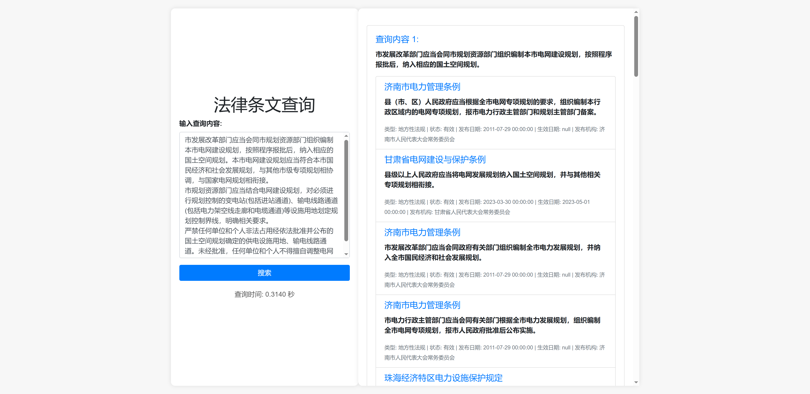

# China Electric Power Law Conflict Detection

## 项目概述
```
该项目旨在构建一个系统，用于检索中国电力相关的法律条文，并检测这些法律条文之间的冲突。项目分为两个主要部分：法律条文的检索和法律冲突的检测。
legal_text_retrieval/
├─data
│  ├─downloader       # 存放用于下载数据的脚本或工具
│  ├─gen_data         # 存放用于生成或预处理数据的脚本或工具
│  ├─processed        # 存放已经处理过的数据，通常用于模型训练或分析
│  └─raw_datasets     # 存放原始数据集
│      ├─chinese law and regulations  # 存放中国法律法规的原始数据集
│      └─laws_zyp     # 存放特定法律数据集的原始数据
├─models              # 存放训练好的模型文件
├─picture             # 存放图片文件
└─src                 # 存放源代码文件
    ├─templates       # 存放模板文件
    └─__pycache__     

```

## 预期功能
-设计一套检索方案的评价指标
构建正负类法律检索数据集。
然后给出检索的速度和准确率，然后换模型，对比模型，评价指标。

- 搭建冲突检测网页

## 2024年7月26日

- 中文冲突检测模型
IDEA-CCNL/Erlangshen-MegatronBert-1.3B-NLI
使用了二郎神的中文自然语言推理模型

- 中文嵌入检索模型
moka-ai/m3e-base

### 2024年7月22日

- 更新法律文件，数量5572-->7262条数据的索引建立，并保存为向量化的pkl文件。


## 项目结构

## 已完成部分

### 1. 数据预处理

- 过滤与电力相关的法律文件，并删除内容过短的记录。
- 将长篇法律条例文本拆分为单条记录，并保存为 JSON 格式。
### 2. 建立索引

- 使用预训练的 m3e-base 模型将法律文本向量化。
- 构建法律文本的向量索引，保存为模型文件。

### 3. 检索逻辑

- 基于用户的查询进行文本检索。
- 使用m3e-base 模型计算查询文本与法律条文的相似度。
- 返回最相似的法律条文作为检索结果。

### 4. 查询接口和主程序

- 实现一个 RESTful API 接口，供用户提交查询并获取检索结果。
- 使用 Flask 框架搭建查询接口服务。

### 5. 评价和优化

- 设计检索精度和效率的评价指标。
- 使用精度 (Precision)、召回率 (Recall)、F1 分数 (F1 Score) 和平均检索时间来评估检索系统的性能。

### 6. web前端可视化


包括输入查询，检索结果，显示检索时间
## 未完成部分

### 1. 法律冲突检测

- 设计冲突检测的算法和逻辑。
- 开发和实现法律条文之间冲突检测的功能。
- 对冲突检测系统进行评估和优化。
- 冲突检测整合到前端


## 安装与使用

### 环境依赖

请确保已经安装以下依赖包：
```
flask
scikit-learn
sentence-transformers
```
